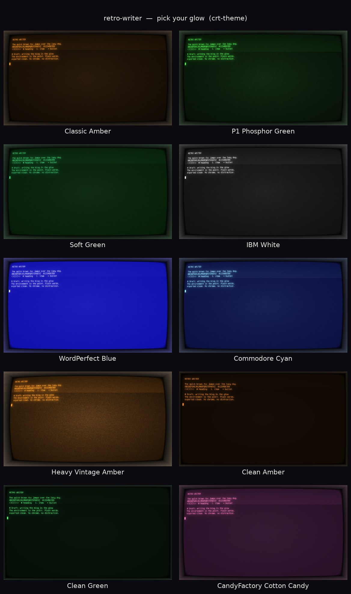

# retro-writer


**A distraction-free retro writing cockpit for Linux.** A real '90s phosphor-glow
CRT screen, a full-screen word processor inside it, and one command to drop into
the glow and write — clean Markdown out the other end.

The environment is the point. No browser tab, no chrome, no blinking app icons —
just amber (or green, or WordPerfect blue) light and your words.



We build at [CandyFactory](https://candyfactory.ai), and we draft our blog posts
in this thing. It's small, it's ours, and it's nicer than any modern editor we
tried — so we're giving it away.

---

## What it is

Three pieces, each doing one job — and a little glue:

| Piece | Job |
|------|-----|
| [**cool-retro-term**](https://github.com/Swordfish90/cool-retro-term) | the *screen* — a real CRT simulator (phosphor bloom, scanlines, curvature, burn-in), not just a color scheme |
| [**WordGrinder**](https://github.com/davidgiven/wordgrinder) | the *word processor* — a fast, full-screen ncurses writer with a menu bar, live word count, and a clean Markdown export |
| `blog` / `blog-export` / `crt-theme` | the *glue* — one-command launch, draft→Markdown export, and a theme picker for the screen look |

```
you type → WordGrinder (.wg in ~/writing/) → blog-export → clean .md
```

That `.md` is yours to publish wherever. (This iteration is deliberately the
*writing* experience; where it publishes is a later, separate step.)

## Requirements

- Linux with cool-retro-term and WordGrinder installed:
  ```sh
  sudo apt install cool-retro-term wordgrinder      # Debian / Ubuntu / Pop!_OS
  ```
- `python3` (for the theme picker). That's it — the rest is shell.

## Platforms

- **Linux — today.** retro-writer runs on Linux now (it needs cool-retro-term and
  WordGrinder, both available on Debian/Ubuntu/Pop!_OS). This is where we use it
  every day.
- **macOS & Windows — planned.** Both are on our roadmap. cool-retro-term and
  WordGrinder exist on those platforms, so the glue is the work; we're tracking
  it and will ship it when it's solid.

## Install

```sh
./bin/install.sh
```

Symlinks `blog`, `blog-export` and `crt-theme` into `~/.local/bin/`, installs the
**Retro Writer** desktop entry into `~/.local/share/applications/`, and creates
`~/writing/`. Make sure `~/.local/bin` is on your `PATH`.

## Usage

- **`blog`** — open the cockpit and write. Launches cool-retro-term fullscreen in
  `~/writing/`, running WordGrinder. (Or click **Retro Writer** in your app menu.)
  Save with `Ctrl-S` / the File menu.
- **`blog-export [file.wg]`** — export a draft to clean Markdown.
  - With an argument: convert that file.
  - With no argument: convert the most-recently-modified `*.wg` in `~/writing/`.
  - Output: a `.md` of the same basename, next to the source.

## Choosing your look

The screen look is chosen with **`crt-theme`**. (Heads-up for hackers:
cool-retro-term 1.2.0's `--profile` CLI flag is a no-op, and the app stores its
settings in a QML LocalStorage **SQLite** DB, not in `~/.config`. `crt-theme`
writes that DB directly and `blog` launches plain — so *whatever theme you last
applied is the look you get.*)

```sh
crt-theme            # interactive picker: a numbered list with live color
                     #   swatches. Pick a number to PREVIEW it (applies the theme
                     #   and opens cool-retro-term). The one you preview LAST stays.
crt-theme list       # show the themes + swatches, no launching
crt-theme set <key>  # apply a theme as the default, quietly (no window)
crt-theme show <key> # apply a theme AND open a preview window
crt-theme current    # show the current colors + which theme they match
```

### The themes

| Key | Look |
|-----|------|
| `amber` | Classic Amber — warm amber on black (the house look) |
| `green-p1` | P1 Phosphor Green — bright green on black |
| `green-soft` | Soft Green — gentler green on a faintly green-tinted black |
| `white-ibm` | IBM White — neutral white, low chroma |
| `wordperfect-blue` | WordPerfect Blue — pale text on the iconic DOS blue |
| `commodore-cyan` | Commodore Cyan — pale cyan on dark navy |
| `vintage-burn` | Heavy Vintage Amber — cranked burn-in, bloom and curve |
| `clean-amber` | Clean Amber — effects near zero, sharp for long sessions |
| `clean-green` | Clean Green — clean-amber but green |
| `cottoncandy` | CandyFactory Cotton Candy — pink on deep plum, playful |

Each theme is a full cool-retro-term profile in `themes/<key>.json`. The effect
intensities are ~0.0–1.0 — tweak the numbers and `crt-theme set` to taste, or
drop in your own `themes/mine.json` + a `manifest.json` entry.

> First run only: launch cool-retro-term once (e.g. `blog`) so it creates its
> settings DB, then `crt-theme` can find and write it.

## Layout

```
bin/blog              one-command launcher
bin/blog-export       .wg → clean .md
bin/crt-theme         the theme picker (python3)
bin/install.sh        symlinks + desktop entry + ~/writing
themes/*.json         one cool-retro-term profile per theme
themes/manifest.json  picker order + labels
desktop/              the COSMIC/.desktop launcher
docs/                 the design spec
media/                the screenshots above
```

`~/writing/` (your drafts) is intentionally **not** in this repo.

## Development & tests

retro-writer is small, but it's tested. Run the whole gate with:

```sh
./run-tests.sh
```

That single script:

1. **shellchecks** the bash scripts (`bin/blog`, `bin/blog-export`, `bin/install.sh`)
   and fails on any finding,
2. runs the **pytest** suite under **coverage.py**, and
3. **fails if `crt-theme` line coverage drops below 95%** (it currently sits at 100%).

Requirements for the suite: `python3`, `pytest`, `coverage`, `shellcheck`, and
`wordgrinder`. The few tests that exercise the real `.wg ↔ .md` conversion are
skipped automatically if `wordgrinder` isn't installed (CI installs it).

```sh
pip install pytest coverage
sudo apt install wordgrinder shellcheck    # Debian / Ubuntu / Pop!_OS
```

**What's covered, honestly:**

- **`crt-theme` (python)** — measured **line + branch coverage** via coverage.py.
  Unit tests drive every command (`list` / `set` / `show` / `current` / the
  interactive menu) and every error path against a **temporary** sqlite DB that
  mirrors cool-retro-term's real schema. Tests **never read or write your real
  cool-retro-term database** — they pin the DB via the `CRT_THEME_DB` override.
- **`blog` / `blog-export` / `install.sh` (bash)** — covered by **behavior + e2e
  tests** (invoked through the real shell via subprocess) and by **shellcheck**.
  Bash *line*-coverage is **not** measured (there's no equivalent gate); the
  behavior tests assert the observable contract instead. `blog` exposes a
  no-launch seam — `blog --print-cmd` (or `RETRO_WRITER_DRY_RUN=1`) prints the
  exact `cool-retro-term …` command and exits without opening a window — so its
  command shape is asserted with no GUI/display.
- **themes** — every `themes/*.json` is validated (parses, shares the 23-key
  profile schema, valid `#rrggbb` colors) and cross-checked against
  `manifest.json` (unique keys, files exist, no orphans).

CI runs the same `./run-tests.sh` on every push and pull request
(see `.github/workflows/ci.yml`); no display or GUI is needed.

---

## Standing on giants — and giving back

retro-writer is mostly *glue*. The magic is two excellent open-source projects we
lean on completely:

- **[cool-retro-term](https://github.com/Swordfish90/cool-retro-term)** by Filippo Scognamiglio — the CRT simulator.
- **[WordGrinder](https://github.com/davidgiven/wordgrinder)** by David Given — the word processor.

Building on them, we ran their code for real and found a couple of honest bugs —
so we sent fixes back upstream rather than just taking:

- WordGrinder: Markdown export silently mangled lines that look like block markers
  (a `---` scene break round-tripped to *nothing*) — reported and fixed with a
  tested PR. ([issue #316](https://github.com/davidgiven/wordgrinder/issues/316) ·
  [PR #317](https://github.com/davidgiven/wordgrinder/pull/317))
- cool-retro-term: `--workdir` wasn't bounds-checked (out-of-bounds read / swallowed
  the next flag) — reported with a one-line fix.
  ([issue #954](https://github.com/Swordfish90/cool-retro-term/issues/954))

If retro-writer is useful to you, go star theirs too — they did the hard part.

## Who made this

[CandyFactory](https://candyfactory.ai) — a small shop that builds software with
AI **and** code, analysis, engineering, and intent. We made this to write with,
we use it every day, and we're releasing it because good tools should be shared.

Issues and PRs welcome.

## License

[MIT](LICENSE) © 2026 CandyFactory
